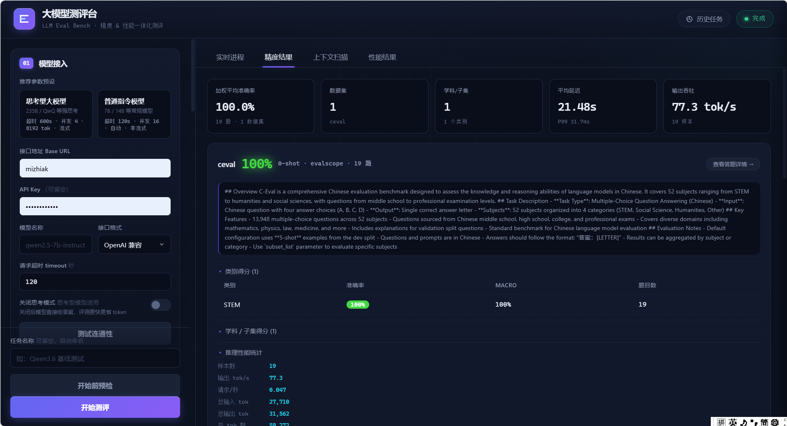
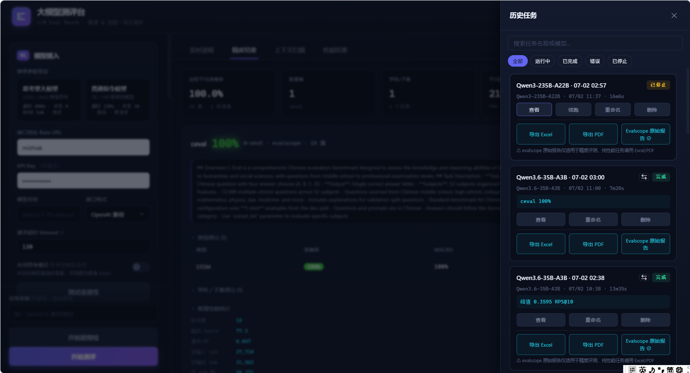
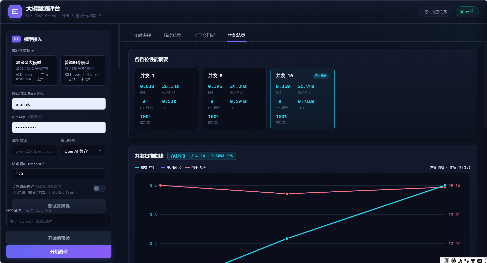
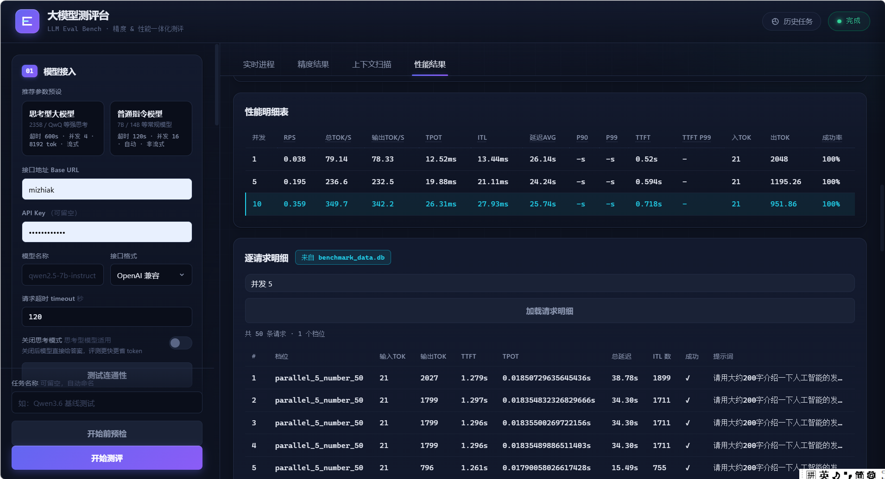

# llm-eval-bench-v2

基于 evalscope 的大模型精度、性能、上下文综合测评台。项目提供一个 FastAPI + 原生前端的 Web UI，用来接入 OpenAI 兼容接口、vLLM、Ollama 等模型服务，并完成精度评测、并发压测、上下文长度扫描、历史任务管理和报告导出。



## 功能亮点

- 模型接入连通性测试：支持 Base URL、API Key、模型名、接口格式、超时和思考模式开关。
- 精度评测：对接 evalscope 内置 benchmark，支持数据集选择、学科/子集过滤、few-shot、抽样、自定义 JSONL 数据集。
- 性能压测：支持多并发档位扫描、请求数配置、流式/非流式、max_tokens/min_tokens、长上下文填充。
- 上下文扫描：按指定上下文长度档位测试吞吐、延迟、成功率等指标。
- 实时任务流：通过 SSE 展示队列、阶段、日志、进度和结果。
- 历史任务：支持查看、续跑、重命名、删除、导出 Excel/PDF、下载 evalscope 原始报告。
- 结果分析：聚合准确率、学科得分、类别得分、RPS、tok/s、TPOT、ITL、TTFT、逐请求明细。

## 界面预览

### 历史任务



### 性能摘要



### 性能明细



## 项目结构

```text
.
├── app/
│   ├── main.py                # FastAPI 入口、REST API、SSE、静态文件挂载
│   ├── task_manager.py        # 任务生命周期、队列调度、历史任务持久化
│   ├── evalscope_client.py    # evalscope service HTTP 客户端
│   ├── evalscope_runner.py    # 精度、性能、上下文扫描编排
│   ├── model_client.py        # OpenAI/vLLM/Ollama 模型调用封装
│   ├── custom_dataset.py      # 自定义数据集转换
│   ├── evalscope_catalog.py   # benchmark 目录和子集缓存
│   └── report.py              # Excel/PDF 报告导出
├── static/
│   ├── index.html             # 单页 UI
│   ├── app.js                 # 前端交互和结果渲染
│   └── style.css              # 暗色测评台样式
├── docs/images/               # README 截图
├── requirements.txt
└── start.sh                   # 同时启动 evalscope service 和 Web 应用
```

## 快速启动

安装依赖：

```bash
pip install -r requirements.txt
```

启动 evalscope service 和 Web 应用：

```bash
chmod +x start.sh
./start.sh
```

应用默认监听：

- Web/API：`http://0.0.0.0:8000`
- evalscope service：`http://127.0.0.1:9000`

如果部署在 Docker 或服务器网关后，可以把宿主机端口映射到 `8002:8000`，然后通过 `http://<host>:8002` 访问。

## 基本用法

1. 在左侧填写模型服务 `Base URL`、`API Key`、模型名称和接口格式。
2. 点击“测试连通性”，确认模型接口可用。
3. 选择精度评测数据集，或开启性能压测、上下文扫描。
4. 点击“开始前预检”，检查 evalscope、数据集缓存、请求规模和潜在风险。
5. 点击“开始测评”，在实时进程和结果页查看进度。
6. 完成后可在历史任务中导出 Excel、PDF 或 evalscope 原始报告。

## 运行数据

运行时数据默认写入：

- `data/tasks/`：任务配置、状态和历史记录
- `data/reports/`：导出的 Excel/PDF
- `custom_datasets/`：上传的自定义数据集
- `/app/outputs/`：evalscope 原始输出目录

这些目录通常不建议提交到 Git，仓库已在 `.gitignore` 中忽略常见运行产物、数据库、JSONL 和环境文件。

## 自定义数据集

前端支持上传 JSONL 数据集。后端会读取并转换为 evalscope 可消费的格式，适合快速验证私有题库、业务问答或多选题集合。

## 说明

本项目侧重内部测评工作台场景，适合在已有模型服务和 evalscope 运行环境中部署。大规模压测前建议先小样本试跑，确认超时、并发、token 预算和数据集缓存状态。
